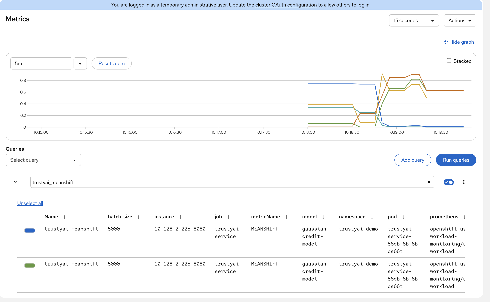

# Data Drift

Most machine learning models are sensitive to data drift—the difference between training data and real-world data received in production. This mismatch can lead to poor model performance, similar to struggling on an exam with unfamiliar material. Since manually detecting drift is impractical at scale, TrustyAI provides data drift monitoring metrics (e.g., Mean-Shift, FourierMMD, Kolmogorov-Smirnov test) to quantify and detect such shifts automatically.

## Context
In this example, we'll be deploying a simple ONNX model using Triton runtime, that predicts credit card acceptance based on an applicant's age, credit score, years of education, and years in employment. We'll deploy this model using
OpenShift AI KServe. 

To monitor data drift, we use the Mean-Shift metric, which compares numeric test data against training data and produces a p-value indicating distribution similarity. A p-value near 1.0 suggests no drift, while a value below 0.05 signals significant drift. Note that Mean-Shift works best for normally distributed features, and other metrics may be preferable for different distributions.

## Setup
### Deploy TrustyAI Service
Follow the instructions within the [Enable TrustyAI](../README.md).

### TrustyAI endpoints are authenticated via a Bearer token. To obtain this token, run the following commands:
```shell
oc create -f - <<EOF 
apiVersion: v1
kind: ServiceAccount
metadata:
  name: user-one
---
kind: RoleBinding
apiVersion: rbac.authorization.k8s.io/v1
metadata:
  name: user-one-view
subjects:
  - kind: ServiceAccount
    name: user-one
roleRef:
  apiGroup: rbac.authorization.k8s.io
  kind: ClusterRole
  name: view
EOF
```

```
export TOKEN=$(oc create token user-one)   
```
### Building the Data Drift ONNX Model - gaussian-credit-model

1. Set up the Python 3.12 environment
```
# Create and activate a virtual environment
python -m venv demo
source demo/bin/activate

# Install dependencies
pip install -r requirements.txt

# For ppc64le architecture, use the extra index for installing dependencies:
pip install -r requirements.txt --prefer-binary --extra-index-url=https://wheels.developerfirst.ibm.com/ppc64le/linux
```
Note:
If you installed dependencies using
`--extra-index-url=https://wheels.developerfirst.ibm.com/ppc64le/linux`,
make sure to set the `LD_LIBRARY_PATH` correctly for `libopenblas` and `libprotobuf`:
```
export LD_LIBRARY_PATH=$LD_LIBRARY_PATH:/<path>/python3.12/site-packages/openblas/lib/:/<path>/python3.12/site-packages/libprotobuf/lib64/
```


2. Build the model
```
python data_drift_onnx_model.py
```

3. Generate the Triton configuration for the built model
```
python ../../common/triton_model_config.py data-drift-model/gaussian-credit-model/1/model.onnx
```
Note:
For this demo, once the model and configuration are ready, upload the generated folder `data-drift-model/gaussian-credit-model/` to your cloud storage.

## Deploy Model
1) Navigate to the `trustyai-demo` created in the setup section
2) Deploy the Triton serving runtime
3) Deploy the credit model
6) From the OpenShift Console, navigate to the `trustyai-demo` project and look at the Workloads -> Pods screen. You should see the following pods within ythe previously created namespace.
    - one pod for the `gaussian-credit-model`
    - one pod for the TrustyAI Service

```bash
oc project trustyai-demo || true
oc apply -f deployment/gaussian-credit-model.yaml
```

## Upload Model Training Data To TrustyAI
First, we'll get the route to the TrustyAI service in our project:
```shell
TRUSTY_ROUTE=https://$(oc get route/trustyai-service --template={{.spec.host}})
```

Next, we'll send our training data to the `/data/upload` endpoint 

```shell
curl -sk -H "Authorization: Bearer ${TOKEN}" $TRUSTY_ROUTE/data/upload  \
  --header 'Content-Type: application/json' \
  -d @data/training_data.json
```
You should see the message `1000 datapoints successfully added to gaussian-credit-model data`.

### The Data Upload Payload
The data upload payload (an example of which is seen in [training_data.json](create-ml-model/data/training_data.json)) contains
four main fields:
1) `model_name`: The name of the model to correlate this data with. This should match the name of the model we provided in the [model yaml](deployment/gaussian-credit-model.yaml), in this case `gaussian-credit-model`
2) `data_tag`: A string tag to reference this particular set of data. Here, we choose `"TRAINING"`
3) `request`: A [KServe Inference Request](https://kserve.github.io/website/0.8/modelserving/inference_api/#inference-request-json-object), as if you were sending this data directly to the model server's `/infer` endpoint. 
4) `response`: (Optionally) the [KServe Inference Response](https://kserve.github.io/website/0.8/modelserving/inference_api/#inference-response-json-objectt) that is returned from sending the above request to the model. 

## Label Data Fields
As you can see, the models does not provide particularly useful field names for our inputs and outputs (all some form of `credit_inputs-x`). We can apply a set of _name mappings_ to these to apply meaningful names to the fields. This is done via POST'ing the `/info/names` endpoint:

```shell
curl -sk -H "Authorization: Bearer ${TOKEN}" -X POST --location $TRUSTY_ROUTE/info/names \
  -H "Content-Type: application/json"   \
  -d "{
    \"modelId\": \"gaussian-credit-model\",
    \"inputMapping\":
      {
        \"credit_inputs-0\": \"Age\",
        \"credit_inputs-1\": \"Credit Score\",
        \"credit_inputs-2\": \"Years of Education\",
        \"credit_inputs-3\": \"Years of Employment\"
      },
    \"outputMapping\": {
      \"predict-0\": \"Acceptance Probability\"
    }
  }"
```

You should see the message`Feature and output name mapping successfully applied.`

The payload of the request is a simple set of `original-name : new-name` pairs, assigning new meaningful names to the input and output
features of our model. 

## Examining TrustyAI's Model Metadata
We can verify that TrustyAI has received the data via `/info` endpoint:  
2) Query the `/info` endpoint:  
```
curl -kH "Authorization: Bearer ${TOKEN}" $TRUSTY_ROUTE/info | jq
```
This will output a json file  containing the following information:

```json
{
  "gaussian-credit-model": {
    "metrics": {
      "scheduledMetadata": {
        "metricCounts": {}
      }
    },
    "data": {
      "inputSchema": {
        "items": {
          "Years of Education": {
            "type": "DOUBLE",
            "name": "credit_inputs-2",
            "columnIndex": 2
          },
          "Years of Employment": {
            "type": "DOUBLE",
            "name": "credit_inputs-3",
            "columnIndex": 3
          },
          "Age": {
            "type": "DOUBLE",
            "name": "credit_inputs-0",
            "columnIndex": 0
          },
          "Credit Score": {
            "type": "DOUBLE",
            "name": "credit_inputs-1",
            "columnIndex": 1
          }
        },
        "nameMapping": {
          "credit_inputs-0": "Age",
          "credit_inputs-1": "Credit Score",
          "credit_inputs-2": "Years of Education",
          "credit_inputs-3": "Years of Employment"
        }
      },
      "outputSchema": {
        "items": {
          "Acceptance Probability": {
            "type": "FLOAT",
            "name": "predict-0",
            "columnIndex": 4
          }
        },
        "nameMapping": {
          "predict-0": "Acceptance Probability"
        }
      },
      "inputTensorName": "input",
      "outputTensorName": "output",
      "observations": 1000
    }
  }
}
```

## Register the Drift Monitoring
To schedule a recurring drift monitoring metric, we'll POST the `/metrics/drift/meanshift/request`

```shell
curl -k -H "Authorization: Bearer ${TOKEN}" -X POST --location $TRUSTY_ROUTE/metrics/drift/meanshift/request -H "Content-Type: application/json" \
  -d "{
        \"modelId\": \"gaussian-credit-model\",
        \"referenceTag\": \"TRAINING\"
      }"
```

The body of the payload is quite simple, requiring a `modelId` to set the model to monitor and a `referenceTag` that
determines which data to use as the reference distribution, in our case `TRAINING` to match the tag we used when we uploaded the training
data. This will then measure the drift of all recorded inference data against
the reference distribution.

## Collect "Real-World" Inferences
1) Get the route to the model: 
```shell
MODEL=gaussian-credit-model
BASE_ROUTE=$(oc get inferenceservice gaussian-credit-model -o jsonpath='{.status.url}')
MODEL_ROUTE="${BASE_ROUTE}/v2/models/${MODEL}/infer"
```

2) Send data payloads to model:
```shell
for batch in {0..595..5}; do
  curl -sk \
  -H "Authorization: Bearer ${TOKEN}" \
  -H "Content-Type: application/json" \
  -d @data/data_batches/$batch.json \
  "${MODEL_ROUTE}"
  sleep 1
done
```

## Check the Metrics
1) Navigate to Observe -> Metrics in the OpenShift console. If you're already on that page, you may need to refresh before the new metrics appear in the suggested expressions.
2) Set the time window to 5 minutes (top left) and the refresh interval to 15 seconds (top right)
3) In the "Expression" field, enter `trustyai_meanshift`. It might take a few seconds before the cluster monitoring stacks picks up the new metric, so if `trustyai_meanshift` is not appearing, try refreshing the page.
4) Explore the Metric Chart:


