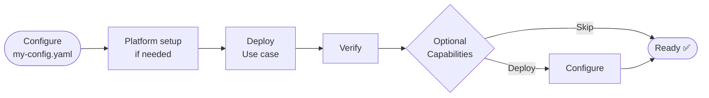

# rhoai-automation

Deploy Red Hat OpenShift AI (RHOAI) and AI use cases on OpenShift with a handful
of commands instead of a manual, multi-step process.

The `rhoai` CLI validates your cluster, installs the operator, configures the
platform, deploys a use case, and waits for each step to become healthy before
continuing.

### Key capabilities

- **One-command platform setup:** Install the RHOAI operator, configure the
  platform, and wait for it to become ready with a single
  `rhoai platform setup`.
- **End-to-end use case deployment:** Deploy, verify, and clean up complete AI
  use cases (for example, Fraud Detection), automatically bootstrapping the
  platform when needed.
- **Flexible inference inputs:** Run inference using either pre-built requests or CSV datasets. The framework automatically generates inference requests from the dataset.

### Supported platforms

| | |
|---|---|
| OpenShift | OCP 4.19+ |
| Architectures | `ppc64le` |
| Python | ≥ 3.12 |

> **The framework orchestrates your manifests and models, it does not ship
> them.** It applies existing YAML in dependency order and waits for health.
> Every use case requires **external assets you provide** — at minimum a model
> and an inference input (a dataset or request payload). Other assets are
> generated for you when omitted: for ONNX models the Triton `config.pbtxt` is
> auto-generated from the model's I/O signature. Each use-case guide lists exactly
> what it needs. See [Deploy a use case](#3-deploy-a-use-case).
---

## How it works

rhoai usecase deploy automatically bootstraps the platform when needed, allowing a new environment to go from configuration to a deployed and verified use case with a single workflow.


---

## Getting Started

This section gets the CLI installed and confirms it works. The install steps run
straight from the repository with **no cluster and no external assets**.
Deploying an actual model needs both.

### 1. Install

```bash
git clone https://github.com/IBM/ai-demos.git && cd ai-demos
git checkout rhoai-automation

python3 -m venv .venv
source .venv/bin/activate

pip install -e openshift-ai-demos/automation   # add "[dev]" to also run tests

rhoai --help
```

### 2. Confirm the tool works

These commands are read-only, they take no assets and (aside from `inspect`)
touch no cluster:

```bash
rhoai usecase list        # every use case registered on your install
rhoai platform inspect    # cluster info: version, storage classes, capacity (needs oc login)
```

`usecase list` is the entry point to everything you can deploy.

### 3. Deploy a use case

Deploying a use case requires external assets that are not included in this repository. Depending on the use case, these may include a model repository, a Triton config.pbtxt, and an inference input such as a request payload or dataset. 

Before you can run a
`deploy` you'll need:

| Requirement | Check |
|---|---|
| `oc` CLI, logged in | `oc login <cluster-url>` |
| Cluster-admin permissions | Required to install the operator (and, for TrustyAI, to write to `openshift-monitoring`) |
| A `ReadWriteOnce` StorageClass | `oc get storageclass` |
| Internet access from nodes | Must reach the registries your use case pulls runtime/model images from |
| The use case's external assets | Listed in that use case's guide |

> Model deployments request cluster resources on a worker node, check capacity
> with `rhoai platform inspect`. Each use-case guide states its exact footprint.

Pick a use case from the **[use-case index](rhoai/usecases/README.md)**, follow
its guide to assemble the assets and write a config, then run the standard
lifecycle. The commands are the same for every use case (`<name>` from
`rhoai usecase list`):

```bash
rhoai usecase deploy  <name> -c my-config.yaml   # bootstrap platform + deploy + smoke test
rhoai usecase verify  <name> -c my-config.yaml   # re-check health
rhoai usecase cleanup <name> -c my-config.yaml   # tear down
```

> **Something failed?** Re-run any command with `--log-level DEBUG` placed
> **before** the subcommand (`rhoai --log-level DEBUG usecase deploy ...`). See
> [Troubleshooting](#troubleshooting--faq).

---

## Common Workflows

Every registered use case shares the same `deploy` / `verify` / `cleanup`
commands; what differs is the config each one accepts. Optional features (such
as TrustyAI bias monitoring) are turned on through
configuration, they do not add separate commands.

- **Standard deployment:** deploy → smoke-test → verify → clean up. The
  framework applies each model's manifests in dependency order and waits for
  health.
- **Bias monitoring:** when a use case's config enables it, deploy sends
  observations, applies name mappings, and schedules fairness (SPD) monitors,
  then reports each result.

Configuration for each of these — sample YAML, field references, required assets,
and expected output, lives in the use-case guides, indexed under
[use cases](rhoai/usecases/README.md).

---

## Command reference

Set log verbosity with `--log-level`/`-l` on the **root** command (before the
subcommand); pass a config with `--config`/`-c` on the subcommand.

### `rhoai platform`

Installs and manages the RHOAI platform itself.

| Command | Purpose |
|---|---|
| `rhoai platform setup` | One-shot bootstrap (init + components) |
| `rhoai platform init` | Install operator + initialize DSCI |
| `rhoai platform enable` / `disable` | Enable / disable DSC components |
| `rhoai platform status` | Report platform health |
| `rhoai platform inspect` | Display cluster info (read-only) |
| `rhoai platform uninstall` | Remove all RHOAI platform resources |

Full reference (channel/version discovery, component list, uninstall behavior):
**[`rhoai/platform/README.md`](rhoai/platform/README.md)**.

### `rhoai usecase`

Deploys customer-facing solutions built on the platform layer.

| Command | Description |
|---|---|
| `rhoai usecase list` | List all registered use cases |
| `rhoai usecase deploy <name>` | Deploy end-to-end, bootstrapping the platform if needed |
| `rhoai usecase verify <name>` | Check that all use-case resources are healthy |
| `rhoai usecase cleanup <name>` | Remove use-case resources (`--delete-platform` also removes DSC/DSCI) |

Use-case index and shared config concepts:
**[`rhoai/usecases/README.md`](rhoai/usecases/README.md)**.

---


## Troubleshooting / FAQ

Most common issues and their quick fixes. For use-case-specific problems, see the
Troubleshooting section of that use case's guide.

| Symptom | Quick fix |
|---|---|
| `rhoai: command not found` | Activate the venv and `pip install -e openshift-ai-demos/automation` |
| `FileNotFoundError` on a manifest path | Set `repo_root` to an **absolute** path (no `~`) |
| OLM `ConstraintsNotSatisfiable` | Use a valid channel: `oc get packagemanifest rhods-operator -o jsonpath='{.status.channels[*].name}'` |
| `InferenceService` stays `Unknown` | Confirm `kserve` is enabled and the PVC is `Bound` |
| Endpoint returns `503` during verify | Wait for the pod; add the ingress IP to `/etc/hosts` if the hostname won't resolve |
| Operations time out on a slow cluster | Raise the relevant `timeouts:` key in your config |
| Any command fails with no clear error | Re-run with `rhoai --log-level DEBUG <subcommand>` |
