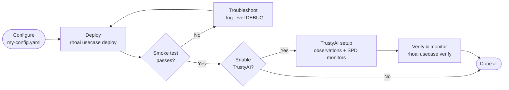

# rhoai-automation

**Install Red Hat OpenShift AI (RHOAI) and deploy working use cases on OpenShift
with a handful of commands** — instead of a manual, multi-step procedure.

The `rhoai` CLI validates your cluster, installs the operator, configures the
platform, deploys a model, runs a smoke test, and (optionally) wires up
TrustyAI bias monitoring — each step waits for health before moving on.

### Key capabilities

- **One-command platform setup** — operator install, DSCInitialization, and
  DataScienceCluster components in a single `rhoai platform setup`.
- **End-to-end use cases** — `deploy` / `verify` / `cleanup` a complete solution
  (e.g. Fraud Detection) that bootstraps the platform if needed.
- **Built-in smoke tests** — every deploy sends a real inference request and
  reports the result.
- **TrustyAI bias monitoring** — send observations, apply name mappings, and
  schedule fairness (SPD) monitors automatically.
- **Flexible inference inputs** — supply a pre-built request or a raw dataset
  and let the framework generate requests for you.

### Supported platforms

| | |
|---|---|
| OpenShift | OCP 4.20+ |
| Architectures | `ppc64le`, `x86_64` |
| Python | ≥ 3.12 |

---

## How it works

The user journey from a fresh config to a monitored, running model:



`deploy` bootstraps the platform automatically if it isn't already installed, so
a first run goes straight from config to a running, smoke-tested model. For the
layered architecture (`cli → platform → ocp → utils`), see
[`docs/README.md`](docs/README.md#2-architecture).

---

## Quick Start

### Prerequisites

| Requirement | Check |
|---|---|
| `oc` CLI, logged in | `oc login <cluster-url>` |
| Cluster-admin permissions | Required to install the operator (and, for TrustyAI, to write to `openshift-monitoring`) |
| A `ReadWriteOnce` StorageClass | `oc get storageclass` |
| Internet access from nodes | Must reach `quay.io/powercloud` (Triton runtime) |

> Model deployments request cluster resources on a worker node — check capacity
> with `rhoai platform inspect`. See a use case's guide for its exact footprint.

### 1. Install

```bash
git clone https://github.com/IBM/ai-demos.git && cd ai-demos
git checkout rhoai-automation

python3 -m venv .venv
source .venv/bin/activate

pip install -e openshift-ai-demos/automation   # add "[dev]" to also run tests

rhoai --help
```

### 2. Deploy your first model

The examples below use the bundled **fraud-detection** use case — see its
[full guide](rhoai/usecases/fraud_detection/README.md) for configuration,
datasets, and expected output. Point `repo_root` in the config at the
**absolute** path of your `openshift-ai-demos` directory, then:

```bash
rhoai usecase deploy fraud-detection -c openshift-ai-demos/automation/config-fraud-detection.yaml
```

This bootstraps the platform (if needed), stages the model, deploys the
InferenceService, and runs a smoke-test inference request.

### 3. Verify

```bash
rhoai usecase verify fraud-detection -c openshift-ai-demos/automation/config-fraud-detection.yaml
```

### 4. Clean up

```bash
# Remove use-case resources only
rhoai usecase cleanup fraud-detection -c openshift-ai-demos/automation/config-fraud-detection.yaml

# ...or also remove the platform (DSC/DSCI)
rhoai usecase cleanup fraud-detection --delete-platform -c openshift-ai-demos/automation/config-fraud-detection.yaml
```

> **Something failed?** Re-run any command with `--log-level DEBUG` placed
> **before** the subcommand (`rhoai --log-level DEBUG usecase deploy ...`). See
> [Troubleshooting](#troubleshooting--faq).

---

## Common Workflows

The same `deploy` / `verify` / `cleanup` commands apply to every registered use
case. `fraud-detection` is the reference use case shipped today. Pick the path
that matches your goal:

| I want to… | How | Guide |
|---|---|---|
| Deploy a model and smoke-test it | `rhoai usecase deploy <name>` | [Use cases](rhoai/usecases/README.md) |
| Deploy **with** bias monitoring | Enable the `trustyai` component + add a `bias_monitoring:` block | [Fraud Detection → TrustyAI](rhoai/usecases/fraud_detection/README.md#trustyai-configuration) · [concepts](docs/bias-readme.md) |
| Generate inference requests from a raw dataset | Set `inference_dataset:` on the model | [Fraud Detection → inference input modes](rhoai/usecases/fraud_detection/README.md#inference-input-modes) |
| Check health / observe metrics | `rhoai usecase verify` · `rhoai platform status` | [Command reference](#command-reference) |

- **Standard deployment** — deploy → smoke-test → verify → clean up, the
  [Quick Start](#quick-start) flow. The framework applies each model's manifests
  in dependency order and waits for health.
- **Bias monitoring** — during deploy the framework sends observations, applies
  name mappings, and schedules fairness (SPD) monitors, then reports each result.
- **Dataset-driven inference** — point a model at a raw dataset and the framework
  generates both the smoke-test request and TrustyAI observations from it.
- **Monitoring & verification** — `verify` re-checks health and re-runs the smoke
  test; `platform status` reports operator and DSC-component health.

Configuration for each of these — sample YAML, field references, datasets, and
expected output — lives in the use-case guides, indexed under
[use cases](rhoai/usecases/README.md) (e.g. the
[Fraud Detection guide](rhoai/usecases/fraud_detection/README.md)).

---

## Command reference

Set log verbosity with `--log-level`/`-l` on the **root** command (before the
subcommand); pass a config with `--config`/`-c` on the subcommand.

### `rhoai platform`

Installs and manages the RHOAI platform itself.

| Command | Purpose |
|---|---|
| `rhoai platform setup` | One-shot bootstrap (init + components) |
| `rhoai platform init` | Install operator + initialize DSCI |
| `rhoai platform enable` / `disable` | Enable / disable DSC components |
| `rhoai platform status` | Report platform health |
| `rhoai platform inspect` | Display cluster info (read-only) |
| `rhoai platform uninstall` | Remove all RHOAI platform resources |

Full reference (channel/version discovery, component list, uninstall behavior):
**[`rhoai/platform/README.md`](rhoai/platform/README.md)**.

### `rhoai usecase`

Deploys customer-facing solutions built on the platform layer.

| Command | Description |
|---|---|
| `rhoai usecase list` | List all registered use cases |
| `rhoai usecase deploy <name>` | Deploy end-to-end, bootstrapping the platform if needed |
| `rhoai usecase verify <name>` | Check that all use-case resources are healthy |
| `rhoai usecase cleanup <name>` | Remove use-case resources (`--delete-platform` also removes DSC/DSCI) |

Use-case index and shared config concepts:
**[`rhoai/usecases/README.md`](rhoai/usecases/README.md)**. Worked example,
sample output, and config reference:
**[Fraud Detection guide](rhoai/usecases/fraud_detection/README.md)**.

---

## Documentation

| Guide | Contents |
|---|---|
| [Architecture & developer docs](docs/README.md) | Layering, project structure, configuration model, testing, adding a use case |
| [Platform CLI reference](rhoai/platform/README.md) | Every `rhoai platform` command in detail |
| [Use cases](rhoai/usecases/README.md) | Use-case index, lifecycle, and shared config concepts |
| [Fraud Detection](rhoai/usecases/fraud_detection/README.md) | Full guide — config reference, inference input modes, TrustyAI, deploy/verify/cleanup |
| [TrustyAI bias monitoring](docs/bias-readme.md) | Observations, name mapping, SPD & identity monitors |
| [Configuration](docs/README.md#5-configuration) | How config is resolved and every supported key |
| [Troubleshooting](docs/troubleshooting.md) | Full cause/fix reference, including timeout tuning |

**Configuration in brief:** values are deep-merged from three sources, highest
priority first — **CLI flags** → **`--config` YAML** → bundled
**`defaults.yaml`**. A user config file only needs the keys it overrides. Full
details in [Configuration](docs/README.md#5-configuration).

---

## Contributing

```bash
# From the repo root, with the venv active:
pip install -e "openshift-ai-demos/automation[dev]"   # pulls in pytest, pytest-mock, ruff

cd openshift-ai-demos/automation
pytest                       # all tests — no live cluster required (Kubernetes I/O is mocked)
ruff check rhoai/            # lint (line-length 100)
```

Architecture invariants, layering rules, and a worked template for adding a new
use case live in [`docs/README.md`](docs/README.md). Contributions require
agreement to the Developer Certificate of Origin — see
[`DCO.txt`](../../DCO.txt).

---

## Troubleshooting / FAQ

Most common issues — see the [full troubleshooting guide](docs/troubleshooting.md)
for causes and detailed fixes.

| Symptom | Quick fix |
|---|---|
| `rhoai: command not found` | Activate the venv and `pip install -e openshift-ai-demos/automation` |
| `FileNotFoundError` on a manifest path | Set `repo_root` to an **absolute** path (no `~`) |
| OLM `ConstraintsNotSatisfiable` | Use a valid channel: `oc get packagemanifest rhods-operator -o jsonpath='{.status.channels[*].name}'` |
| `InferenceService` stays `Unknown` | Confirm `kserve` is enabled and the PVC is `Bound` |
| Endpoint returns `503` during verify | Wait for the pod; add the ingress IP to `/etc/hosts` if the hostname won't resolve |
| Operations time out on a slow cluster | Raise the relevant `timeouts:` key in your config |
| Any command fails with no clear error | Re-run with `rhoai --log-level DEBUG <subcommand>` |

**→ [Full troubleshooting guide](docs/troubleshooting.md)**
