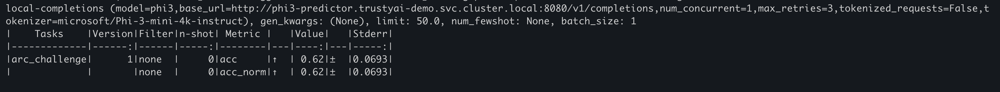

# TrustyAI Evaluation Quickstart

TrustyAI's LM-Eval framework brings popular open-source evaluation toolkits to OpenShift AI. Currently,
it supports the [lm-evaluation-harness](https://github.com/EleutherAI/lm-evaluation-harness/tree/main).

In this example, we'll deploy a Phi3 model and run an Arc-Easy evaluation against it.
[Arc](https://huggingface.co/datasets/allenai/ai2_arc) is an immensely popular evaluation that measures a model against a number of grade-school level, multiple-choice science questions.

---
### Prerequisites

1. Complete the setup steps in the [OpenShift AI README](/openshift-ai-demos/README.md):
   - Configure DSCInitialization and DataScienceCluster
   - Create S3 secret with your storage credentials

2. **Important**: Ensure your DataScienceCluster ([`dsc.yaml`](/openshift-ai-demos/shared/dsc.yaml)) has TrustyAI eval settings configured to allow downloading remote datasets:
   ```yaml
   spec:
     trustyai:
       eval:
         lmeval:
           permitCodeExecution: allow
           permitOnline: allow
       managementState: Managed
   ```

3. Cluster requirements:
   - Default Storage Class configured
   - At least 10 vCPUs available on a worker node
   - At least 24 GB of memory available on a worker node

By default, TrustyAI prevents evaluation jobs from accessing the internet or running downloaded code.
A typical evaluation job will download two items from Huggingface:
1) The dataset of the evaluation task, and any dataset processing code
2) The tokenizer of your model

If you trust the source of your dataset and tokenizer, you can override TrustyAI's default setting.
In our case, we'll be downloading:
1) [allenai/ai2_arc](https://huggingface.co/datasets/allenai/ai2_arc)
2) [Phi-3-mini-4k-instruct's tokenizer](https://huggingface.co/microsoft/Phi-3-mini-4k-instruct)

---
### 1. Deploy Phi3 Model

Navigate to the OpenShift AI demos directory:
```bash
cd ai-demos/openshift-ai-demos
```

Create project:
```bash
oc new-project trustyai-demo || oc project trustyai-demo
```

Deploy the model (see [vLLM Model Serving guide](/openshift-ai-demos/model-serving/generative-models/vllm/README.md) for details):
```bash
oc process -n redhat-ods-applications vllm-cpu-runtime-template | oc create -f -
oc apply -f model-serving/generative-models/vllm/phi-3-mini-4k-instruct.yaml
```

Wait for the model pod to spin up, should look something like `phi3-predictor-XXXXXX`

You can test the model by sending some inferences to it:

```bash
RAW_MODEL=https://$(oc get route phi3 -o jsonpath='{.spec.host}')
curl -ks -X POST "$RAW_MODEL/v1/chat/completions" -H 'accept: application/json' -H 'Content-Type: application/json'   -d '{
    "model": "phi3",
    "messages": [
      {
        "content": "The capital of France is",
        "role": "user"
      }
]}' | jq
````
---

### 2. Run the evaluation
To start an evaluation, apply an `LMEvalJob` custom resource:
```bash
oc apply -f trustyai/llm-evaluation/eval-quickstart/evaluation_job.yaml
```

Check out [evaluation_job.yaml](evaluation_job.yaml) to learn more about the `LMEvalJob` specification.


If everything has worked, you should see a pod called `arc-easy-eval-job` running in your namespace. 
```bash
oc get pods -w
NAME                              READY   STATUS            RESTARTS   AGE
arc-easy-eval-job                 1/1     Running           0          31s
phi3-predictor-54f5c789f7-zczmd   1/1     Running           0          5m32s
```

You can watch the progress of your evaluation job by running:
```bash
oc logs -f arc-easy-eval-job
```

---
### 3. Check out the results
After the evaluation finishes, you can take a look at the results. These are stored in the `status.results` field of the LMEvalJob resource:

```bash
oc get pods
NAME                              READY   STATUS      RESTARTS   AGE
arc-easy-eval-job                 0/1     Completed   0          15m
phi3-predictor-54f5c789f7-zczmd   1/1     Running     0          20m
```
```bash
oc get LMEvalJob arc-easy-eval-job -o template --template '{{.status.results}}' | jq  .results
```
returns:
```json
{
  "arc_challenge": {
    "alias": "arc_challenge",
    "acc,none": 0.62,
    "acc_stderr,none": 0.06934092056863767,
    "acc_norm,none": 0.62,
    "acc_norm_stderr,none": 0.06934092056863767
  }
}
```
Screenshot showing the evaluation results from the pod logs:



The Phi model a 62% accuracy on the `arc_challenge` task and 62% when using a more stringent, normalized scoring method. Both scores have a margin of error of about ±7%. This performance is typically used to compare the reasoning abilities of this language model against others.

### More info:
- [Redhat Doc](https://docs.redhat.com/en/documentation/red_hat_openshift_ai_cloud_service/1/html/monitoring_data_science_models/evaluating-large-language-models_monitor)
- [GitHub lm-evaluation-harness](https://github.com/EleutherAI/lm-evaluation-harness)