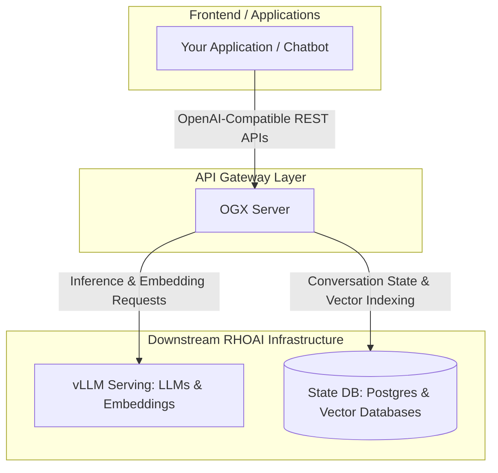

# Build Enterprise RAG Applications Faster with OGX on Red Hat OpenShift AI

Large Language Models (LLMs) are powerful, but they can generate inaccurate answers when asked about information outside their training data.

**Retrieval-Augmented Generation (RAG)** improves accuracy by retrieving relevant information from your documents before the model generates a response. This enables AI applications to deliver answers that are grounded in your organization's data.

Building a RAG application typically requires integrating multiple components, including an LLM, an embedding model, a vector database, and application logic to orchestrate them.

**OGX (Open GenAI Stack)** simplifies this process by exposing all these services through a single OpenAI-compatible API. Instead of managing multiple AI components, your application interacts only with OGX, which handles document indexing, embedding generation, vector search, and prompt orchestration behind the scenes.

This guide introduces a simpler approach: **[OGX (Open GenAI Stack)](https://github.com/ogx-ai/ogx)** deployed on **Red Hat OpenShift AI (RHOAI)**. 

### What You'll Build

In this guide, you'll deploy a complete RAG stack on Red Hat OpenShift AI, including:

- A Llama 3.2 3B instruct inference model
- A Granite 125m English embedding model
- A Qdrant vector database
- A PostgreSQL database
- An OGX Server that exposes a single OpenAI-compatible API

You'll then upload sample documents, index them, and query them from a Python application using the standard OpenAI SDK.

By the end of this guide, you'll understand how OGX simplifies enterprise AI development while enabling applications to deliver accurate, context-aware responses.

---

## Prerequisites

- Red Hat OpenShift AI 3.4 or later with a default StorageClass configured.
- OpenShift CLI (oc) 
- Python 3.12 or later
- Permissions to create Pods, Services, Secrets, Routes, and Custom Resources
- Model artifacts for [Llama-3.2-3B-Instruct](https://huggingface.co/meta-llama/Llama-3.2-3B-Instruct) and [granite-embedding-125m-english](https://huggingface.co/ibm-granite/granite-embedding-125m-english) uploaded to an S3-compatible object storage bucket. Alternatively, you can store the model artifacts on a PersistentVolumeClaim (PVC)

> Basic familiarity with OpenShift is helpful, but no deep Kubernetes experience is required.

---

## How OGX Works

Your application communicates with a single OpenAI-compatible API exposed by OGX.

Behind the scenes, OGX:

1. **Receives application requests** via standard API formats.
2. **Communicates with model endpoints** to get text completions or generate embeddings.
3. **Manages vector searches** against your databases to find relevant documents.
4. **Persists application state and metadata** (such as conversation history and document indexes) in a state database like PostgreSQL.
5. **Hides infrastructure complexity**, allowing you to swap out model providers or database backends without changing your application code.



> [!IMPORTANT]
> **Technology Preview Warning**  
> OGX integration is currently available in Red Hat OpenShift AI 3.4 as a Technology Preview feature.

### Key OGX Concepts

* **OGX Operator**: Deploys and manages OGX instances in OpenShift AI.
* **OGXServer Custom Resource (CR)**: Defines how an OGX Server is configured and connected to backend services.
* **OGX Distribution**: The containerized server image shipped by Red Hat that executes the OGX engine inside your cluster.

---

## Deploying OGX on Red Hat OpenShift AI (RHOAI)

In the following sections, you'll deploy each component of the RAG platform. After completing the deployment, you'll build a simple RAG application that queries your own documents through OGX.

---

### Step 0: Create the Project Namespace
All backend resources (models, databases, and the OGX Server) in this guide are deployed to the same OpenShift namespace. We will create and switch to a namespace named `ogx-sandbox`.

Run the following command to create and set the active project context:
```bash
oc new-project ogx-sandbox
```

Next, create the S3 data connection Secret that OpenShift AI/KServe uses to fetch model weights from object storage:
```bash
oc create -f - <<EOF 
apiVersion: v1
stringData:
  AWS_ACCESS_KEY_ID: "YOUR_AWS_ACCESS_KEY_ID"
  AWS_DEFAULT_REGION: "YOUR_AWS_DEFAULT_REGION"
  AWS_S3_BUCKET: "YOUR_AWS_S3_BUCKET"
  AWS_S3_ENDPOINT: "YOUR_AWS_S3_ENDPOINT"
  AWS_SECRET_ACCESS_KEY: "YOUR_AWS_SECRET_ACCESS_KEY"
kind: Secret
metadata:
  annotations:
    opendatahub.io/connection-type: s3
    opendatahub.io/connection-type-ref: s3
    openshift.io/description: "S3 connection details for model storage used by KServe InferenceService"
    openshift.io/display-name: s3-creds
  labels:
    opendatahub.io/dashboard: "true"
    opendatahub.io/managed: "true"
  name: s3-creds
type: Opaque
EOF
```

---

### Step 1: Enable OGX and KServe in the DataScienceCluster (DSC)
You can activate the OGX Operator and KServe model serving on your OpenShift cluster by setting their `managementState` to `Managed` in the OpenShift AI Operator `DataScienceCluster` custom resource (CR). You can edit the CR in the OpenShift web console or by using the OpenShift CLI (`oc`).

To activate the OGX Operator and KServe from the OpenShift CLI (`oc`), run the following patch command (replace `<name>` with your `DataScienceCluster` name, for example, `default-dsc`):
```bash
oc patch datasciencecluster <name> --type=merge -p '{"spec":{"components":{"ogx":{"managementState":"Managed"},"kserve":{"managementState":"Managed"}}}}'
```

Alternatively, you can apply this specification declaratively:
```yaml
apiVersion: datasciencecluster.opendatahub.io/v1
kind: DataScienceCluster
metadata:
  name: default-dsc
spec:
  components:
    kserve:
      managementState: Managed
    ogx:
      managementState: Managed
```

#### Verification Step
Verify that both the OGX and KServe components' management states are successfully updated to `Managed`:
```bash
oc get datasciencecluster default-dsc -o jsonpath='{.spec.components.ogx.managementState}'
oc get datasciencecluster default-dsc -o jsonpath='{.spec.components.kserve.managementState}'
```
*Expected Output:* `Managed` for both command outputs.

---

### Step 2: Deploy the LLM (Large Language Model)
An **Inference Server** is a service that hosts and runs AI models (like vLLM) so applications can get text predictions. OGX requires an active model endpoint to generate answers. Here, we deploy a vLLM server hosting the Llama 3.2 3B Instruct model.

First, initialize the CPU or GPU runtime template provided by OpenShift AI:
```bash
oc process -n redhat-ods-applications vllm-cpu-runtime-template | oc create -f -
```

Next, deploy the model serving resource (the `InferenceService`):
```bash
oc create -f - <<EOF 
apiVersion: serving.kserve.io/v1beta1
kind: InferenceService
metadata:
  annotations:
    modelFormat: vLLM
    opendatahub.io/connection-path: models/llama-3-2-3b-instruct
    opendatahub.io/connections: s3-creds
    opendatahub.io/model-type: generative
    openshift.io/display-name: llama-32-3b-instruct
    security.opendatahub.io/enable-auth: "false"
    serving.kserve.io/deploymentMode: Standard
    serving.kserve.io/stop: "false"
  finalizers:
  - odh.inferenceservice.finalizers
  - inferenceservice.finalizers
  labels:
    networking.kserve.io/visibility: exposed
    opendatahub.io/dashboard: "true"
  name: llama-32-3b-instruct
spec:
  predictor:
    automountServiceAccountToken: false
    deploymentStrategy:
      type: RollingUpdate
    maxReplicas: 1
    minReplicas: 1
    model:
      args:
      - --enable-chunked-prefill
      - --enable-auto-tool-choice
      - --tool-call-parser=llama3_json
      - --max-model-len=8192
      - --chat-template=/app/data/template/tool_chat_template_llama3.2_json.jinja
      env:
      - name: VLLM_CPU_KVCACHE_SPACE
        value: "14"
      modelFormat:
        name: vLLM
      name: ""
      resources:
        limits:
          cpu: "32"
          memory: 48Gi
        requests:
          cpu: "32"
          memory: 48Gi
      runtime: vllm-cpu-runtime
      storage:
        key: s3-creds
        path: models/llama-32-3b-instruct
    timeout: 600
EOF
```

#### Verification Step
Check if the Llama inference service has started:
```bash
# oc get inferenceservices llama-32-3b-instruct
NAME                   URL                                                                   READY   PREV   LATEST   PREVROLLEDOUTREVISION   LATESTREADYREVISION   AGE
llama-32-3b-instruct   https://llama-32-3b-instruct-ogx-sandbox.apps.rdr-varad-421.ocp-rhoai.com   True                                                                  23d
```

---

### Step 3: Deploy the Embedding Model
Before document texts can be searched semantically, they must be converted into **embeddings** (mathematical representations of meaning). We deploy a second vLLM server hosting the `granite-embeddings` model to generate these vectors.

Apply the configuration:
```bash
oc create -f - <<EOF 
apiVersion: serving.kserve.io/v1beta1
kind: InferenceService
metadata:
  annotations:
    modelFormat: vLLM
    opendatahub.io/connection-path: models/granite-embedding-125m-english
    opendatahub.io/connections: s3-creds
    opendatahub.io/model-type: generative
    openshift.io/display-name: granite-embeddings
    security.opendatahub.io/enable-auth: "false"
    serving.kserve.io/deploymentMode: Standard
    serving.kserve.io/stop: "false"
  labels:
    networking.kserve.io/visibility: exposed
    opendatahub.io/dashboard: "true"
  name: granite-embeddings
spec:
  predictor:
    automountServiceAccountToken: false
    deploymentStrategy:
      type: RollingUpdate
    maxReplicas: 1
    minReplicas: 1
    model:
      args:
      - --hf-overrides
      - '{"is_matryoshka":true,"matryoshka_dimensions":[768]}'
      modelFormat:
        name: vLLM
      name: ""
      resources:
        limits:
          cpu: "8"
          memory: 16Gi
        requests:
          cpu: "8"
          memory: 16Gi
      runtime: vllm-cpu-runtime
      storage:
        key: s3-creds
        path: models/granite-embedding-125m-english
    timeout: 600
EOF
```

#### Verification Step
Verify that the Granite embedding service is ready:
```bash
# oc get inferenceservices granite-embeddings
NAME                   URL                                                                   READY   PREV   LATEST   PREVROLLEDOUTREVISION   LATESTREADYREVISION   AGE
granite-embeddings   https://granite-embeddings-ogx-sandbox.apps.rdr-varad-421.ocp-rhoai.com   True                                                                  22d
```

---

### Step 4: Deploy PostgreSQL for Server State
The OGX server requires a database to store its configuration settings, session metadata, conversation logs, and file reference tables. We will deploy a standard PostgreSQL database inside the project.

Run the following command to deploy PostgreSQL and create the connection secrets:
```bash
oc create -f - <<EOF 
apiVersion: v1
kind: Pod
metadata:
  name: postgres
  labels:
    app: postgres
spec:
  containers:
    - name: postgres
      image: registry.redhat.io/rhel9/postgresql-16
      env:
        - name: POSTGRESQL_USER
          value: ogx
        - name: POSTGRESQL_PASSWORD
          value: ogx
        - name: POSTGRESQL_DATABASE
          value: ogx
      ports:
        - containerPort: 5432
---
apiVersion: v1
kind: Service
metadata:
  name: postgres
spec:
  selector:
    app: postgres
  ports:
    - port: 5432
      targetPort: 5432
---
apiVersion: v1
kind: Secret
metadata:
  name: postgres-credentials
type: Opaque
stringData:
  POSTGRES_HOST: postgres.ogx-sandbox.svc.cluster.local
  POSTGRES_PORT: "5432"
  POSTGRES_DB: ogx
  POSTGRES_USER: ogx
  POSTGRES_PASSWORD: ogx
EOF
```

#### Verification Step
Verify that the PostgreSQL database pod is active and listening:
```bash
# oc get pods -l app=postgres
NAME       READY   STATUS    RESTARTS   AGE
postgres   1/1     Running   0          7d2h

# oc get svc postgres
NAME       TYPE        CLUSTER-IP      EXTERNAL-IP   PORT(S)    AGE
postgres   ClusterIP   172.30.50.124   <none>        5432/TCP   14d
```
*Expected Output:* The pod `postgres` should have status `Running` and the service `postgres` should be listed with a cluster IP.

---

### Step 5: Deploy Standalone Qdrant for Vector Storage
Qdrant is an open source vector database that stores and indexes document embeddings for semantic search. In this guide, it serves as the vector store for OGX, enabling Retrieval-Augmented Generation (RAG) by efficiently retrieving relevant document chunks before they are sent to the language model.

Apply the configuration:
```bash
oc create -f - <<EOF 
apiVersion: v1
kind: Secret
metadata:
  name: qdrant-credentials
type: Opaque
stringData:
  QDRANT_API_KEY: "abc12345"
---
apiVersion: v1
kind: PersistentVolumeClaim
metadata:
  name: qdrant-pvc
spec:
  accessModes:
  - ReadWriteOnce
  resources:
    requests:
      storage: 1Gi
---
apiVersion: apps/v1
kind: Deployment
metadata:
  name: qdrant-deployment
spec:
  replicas: 1
  selector:
    matchLabels:
      app: qdrant-app
  template:
    metadata:
      labels:
        app: qdrant-app
    spec:
      containers:
      - name: qdrant
        image: icr.io/ppc64le-oss/qdrant-ppc64le:1.14.1
        ports:
        - name: http
          containerPort: 6333
        - name: grpc
          containerPort: 6334
        env:
        - name: qdrant-service_API_KEY
          valueFrom:
            secretKeyRef:
              name: qdrant-credentials
              key: QDRANT_API_KEY
        volumeMounts:
        - name: qdrant-storage
          mountPath: /qdrant/storage
        - name: qdrant-storage
          mountPath: /qdrant/snapshots
          subPath: snapshots
        readinessProbe:
          httpGet:
            path: /readyz
            port: 6333
          initialDelaySeconds: 5
          periodSeconds: 10
        livenessProbe:
          httpGet:
            path: /healthz
            port: 6333
          initialDelaySeconds: 10
          periodSeconds: 20
      volumes:
      - name: qdrant-storage
        persistentVolumeClaim:
          claimName: qdrant-pvc
---
apiVersion: v1
kind: Service
metadata:
  name: qdrant-service
spec:
  selector:
    app: qdrant-app
  ports:
  - name: http
    port: 6333
    targetPort: 6333
  - name: grpc
    port: 6334
    targetPort: 6334
  type: ClusterIP
EOF
```

#### Verification Step
Verify that the Qdrant service and pod have started and are running:
```bash
# oc get pods -l app=qdrant-app
NAME                                       READY   STATUS    RESTARTS   AGE
qdrant-deployment-cf77cd4cd-cwbhq   1/1     Running   0          18d

# oc get svc qdrant-service
NAME             TYPE        CLUSTER-IP     EXTERNAL-IP   PORT(S)             AGE
qdrant-service   ClusterIP   172.30.50.75   <none>        6333/TCP,6334/TCP   18d
```

---

### Step 6: Deploy the OGX Application Server
Now, we deploy the OGX server Custom Resource. This resource connects the client application layer to downstream services - our vLLM inference engine, the Postgres state database, and the Qdrant standalone vector database.

Apply the configuration:
```bash
oc create -f - <<EOF 
apiVersion: ogx.io/v1beta1
kind: OGXServer
metadata:
  name: ogxserver
spec:
  distribution:
    name: rh-dev
  network:
    port: 8321
  workload:
    overrides:
      env:
        - name: POSTGRES_HOST
          valueFrom:
            secretKeyRef:
              name: postgres-credentials
              key: POSTGRES_HOST
        - name: POSTGRES_PORT
          valueFrom:
            secretKeyRef:
              name: postgres-credentials
              key: POSTGRES_PORT
        - name: POSTGRES_DB
          valueFrom:
            secretKeyRef:
              name: postgres-credentials
              key: POSTGRES_DB
        - name: POSTGRES_USER
          valueFrom:
            secretKeyRef:
              name: postgres-credentials
              key: POSTGRES_USER
        - name: POSTGRES_PASSWORD
          valueFrom:
            secretKeyRef:
              name: postgres-credentials
              key: POSTGRES_PASSWORD
        - name: VLLM_URL
          value: http://llama-32-3b-instruct-predictor.ogx-sandbox.svc.cluster.local:8080/v1
        - name: VLLM_TLS_VERIFY
          value: "false"
        - name: VLLM_API_TOKEN
          value: "fake"
        - name: VLLM_MAX_TOKENS
          value: "80"
        - name: VLLM_EMBEDDING_URL
          value: http://granite-embeddings-predictor.ogx-sandbox.svc.cluster.local:8080/v1
        - name: EMBEDDING_MODEL
          value: "granite-embeddings"
        - name: EMBEDDING_PROVIDER_MODEL_ID
          value: "granite-embeddings"
        - name: EMBEDDING_DIMENSION
          value: "768"
        - name: QDRANT_URL
          value: "http://qdrant-service.ogx-sandbox.svc.cluster.local:6333"
        - name: QDRANT_API_KEY
          valueFrom:
            secretKeyRef:
              name: qdrant-credentials
              key: QDRANT_API_KEY
        - name: ENABLE_QDRANT
          value: "qdrant-remote"
EOF
```

#### Verification Step
Check if the OGX server has successfully initialized and is ready to receive requests:
```bash
# oc get ogxserver ogxserver
NAME        PHASE   PROVIDERS   AVAILABLE   AGE
ogxserver   Ready               1           26h

# oc get svc ogxserver-service
NAME                TYPE        CLUSTER-IP      EXTERNAL-IP   PORT(S)    AGE
ogxserver-service   ClusterIP   172.30.74.128   <none>        8321/TCP   26h

# Get Service endpoint
# oc get ogxserver ogxserver -o jsonpath='{.status.serviceURL}'
http://ogxserver-service.ogx-sandbox.svc.cluster.local:8321
```

---

## Running Your First RAG Demo

In this section, you'll build a simple Retrieval-Augmented Generation (RAG) application using OGX. You'll upload a sample document, index it into a vector store, and query it using a Python client. OGX will retrieve the most relevant content from the document before generating a response.  

### 1. Create a Knowledge Base Document
Run the following command to create a local text file named `return-policy.txt` containing the grounding rules. The RAG system will search this text to answer questions:
```bash
cat <<EOF > return-policy.txt
Standard return window is 30 days from purchase. Returns require original receipt.
Electronics must be returned within 15 days of delivery.
EOF
```

### 2. Install the Client SDK
Ensure you install the required Python client package in your terminal:
```bash
pip install ogx-client
```
---

### 3. Running the Python Script

Here is the complete Python script to run the RAG demo. You can copy and execute this block inside your development environment:

```python
# First, ensure you install the client SDK:
# pip install ogx-client

from ogx_client import OgxClient

# Step A: Connect to OGX
# Create an OgxClient instance that connects to the OGX server running inside your cluster.
OGX_CONNECTION_URL = "http://ogxserver-service.ogx-sandbox.svc.cluster.local:8321"
client = OgxClient(base_url=OGX_CONNECTION_URL)

# Step B: Create a Vector Store
# A vector store is a specialized database that stores embeddings and allows semantic search. 
# Instead of matching exact words, it finds text with similar meaning.
vector_store = client.vector_stores.create(
    name="techmart_policy_store",
    extra_body={
        "embedding_model": "vllm-embedding/granite-embeddings",
        "embedding_dimension": 768,
        "provider_id": "qdrant-remote"
    },
)
print(f"Created vector store: {vector_store.id}")

# Step C: Upload a Document
# Upload our return policy text document to the OGX file server storage.
with open("return-policy.txt", "rb") as f:
    file_info = client.files.create(
        file=("return-policy.txt", f),
        purpose="assistants",
    )
print(f"Uploaded file: {file_info.id}")

# Step D: Index the Document
# Before documents can be searched semantically, they must be converted into embeddings. 
# We associate the file, which instructs OGX to chunk it, generate vector embeddings, and save them.
vector_store_file = client.vector_stores.files.create(
    vector_store_id=vector_store.id,
    file_id=file_info.id,
    chunking_strategy={
        "type": "static",
        "static": {
            "max_chunk_size_tokens": 400,
            "chunk_overlap_tokens": 100,
        },
    },
)
print(f"Indexed file: {vector_store_file.id}")

# Step E: Query the Knowledge Base
# Ask the model a question. Under the hood, OGX performs a semantic vector search 
# against the vector database to retrieve facts and feeds them to the LLM.
response = client.with_options(timeout=120.0).responses.create(
    model="vllm-inference/llama-32-3b-instruct",
    input="What is the return window for electronics in tech mart?",
    tools=[
        {
            "type": "file_search",
            "vector_store_ids": [vector_store.id],
        }
    ],
)

print("\n--- Answer ---")
print(response.output_text)
```


#### Expected Output
When running the final script, you should receive a response grounded strictly in the contents of `return-policy.txt`:
```text
--- Answer ---
Electronics must be returned within 15 days of delivery.
```

Reference:
-  RHOAI deployment - https://docs.redhat.com/en/documentation/red_hat_openshift_ai_self-managed/3.5/html/installing_and_uninstalling_openshift_ai_self-managed/index
- OGX Examples on RHOAI - https://docs.redhat.com/en/documentation/red_hat_openshift_ai_self-managed/3.5/html/working_with_ogx/ogx-adv-examples_rag 