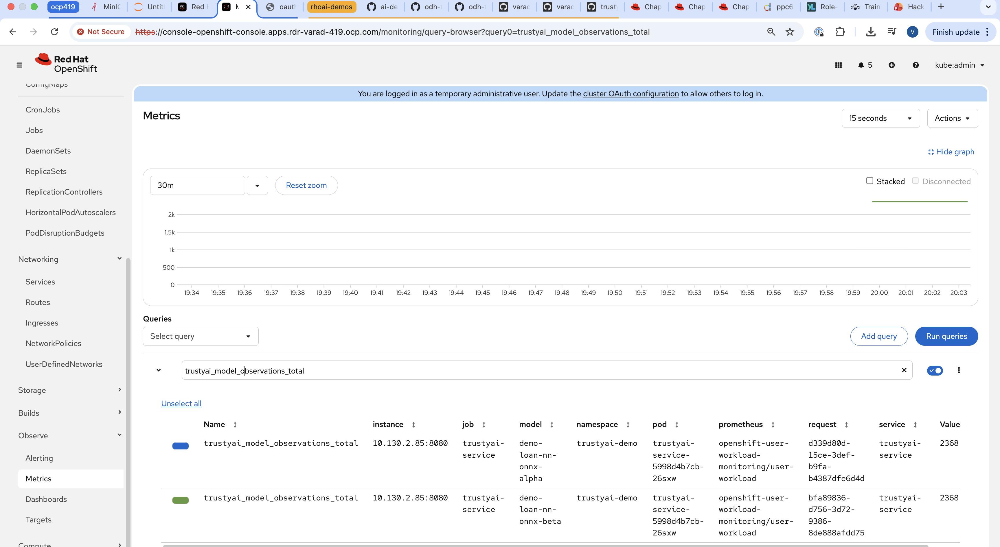
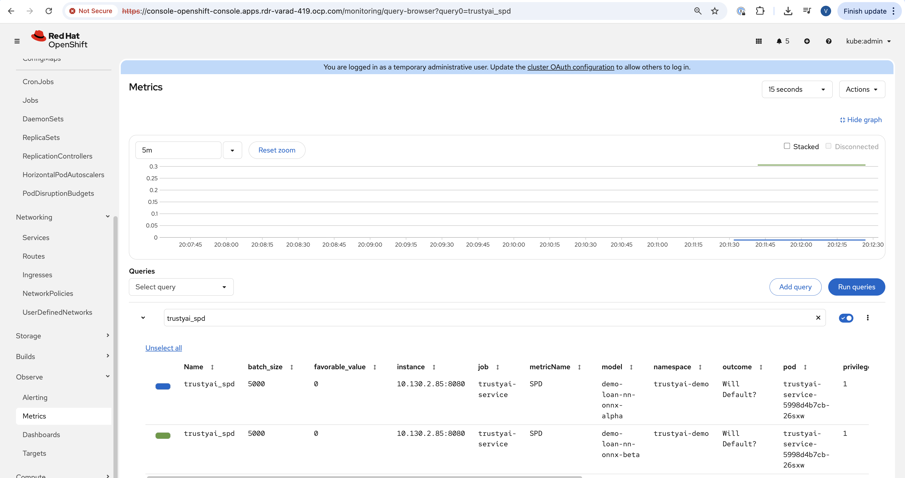
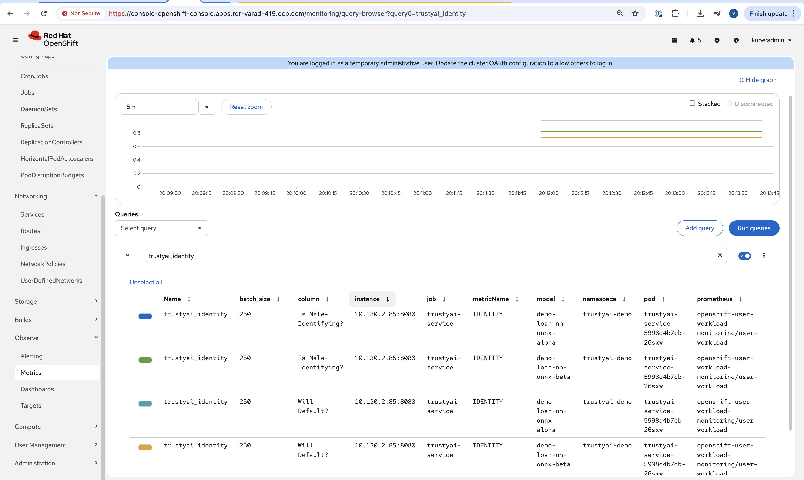
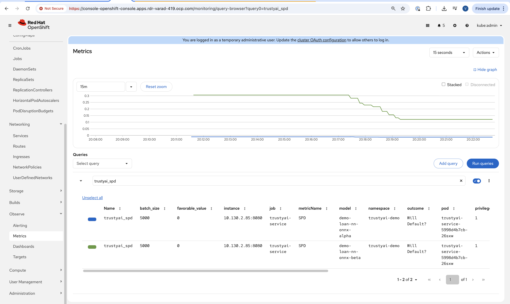
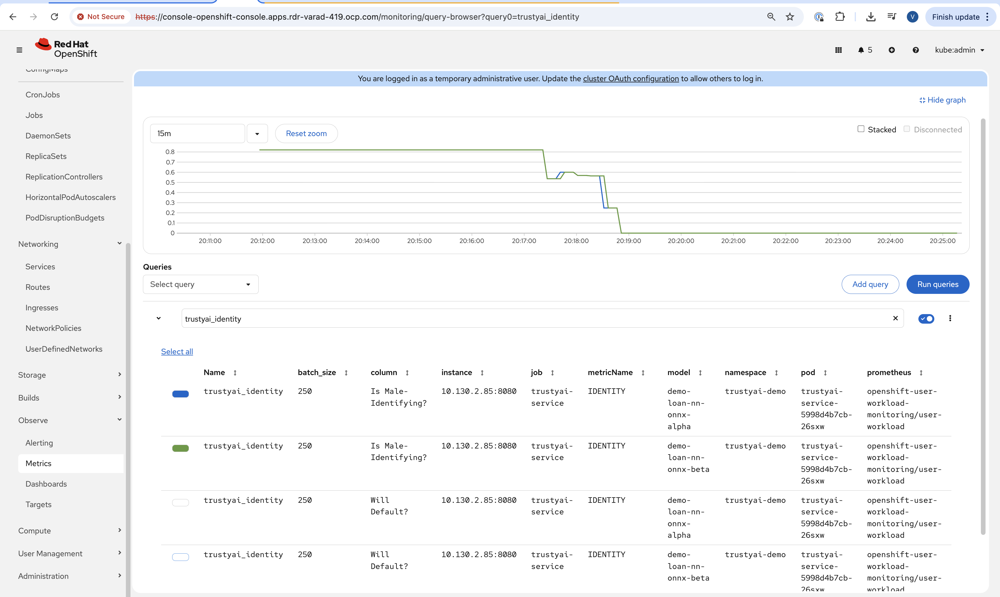
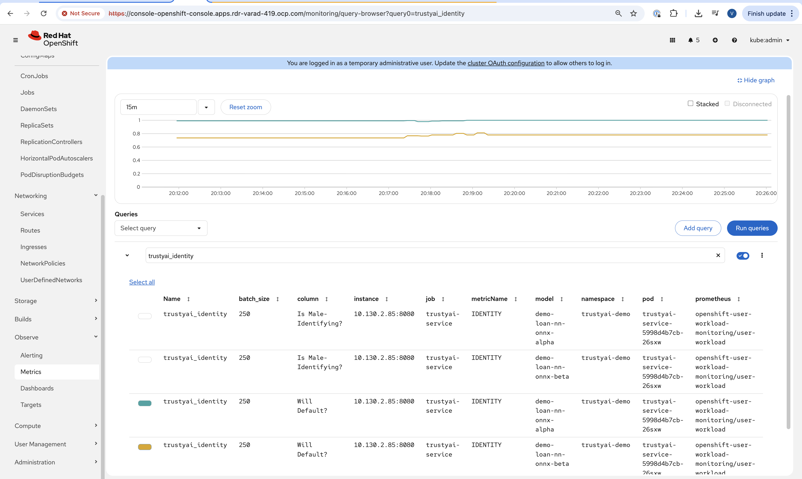

# Bias Monitoring via TrustyAI in RHOAI
Ensuring that your models are fair and unbiased is a crucial part of establishing trust in your models amonst
your users. While fairness can be explored during model training, it is only during deployment
that your models have exposure to the outside world. It does not matter if your models are unbiased on the training data, if they are dangerously biased over real-world data, and therefore it is absolutely
crucial to monitor your models for fairness during real-world deployments:

This demo will explore how to use TrustyAI to monitor models for bias, and how not all model biases are visible at training time.

## Context
We will take on the persona of a dev-ops engineer for a credit lender. Our data scientists have created two candidate neural networks to predict if a borrower will default on the loan they hold with us. Both models use the following information about the applicant to make their prediction:

* Number of Children
* Total Income:
* Number of Total Family Members
* Is Male-Identifying?
* Owns Car?
* Owns Realty?
* Is Partnered?
* Is Employed?
* Lives with Parents?
* Age (in days)
* Length of Employment (in days)

What we want to verify is that neither of our models are not biased over the gender field of `Is Male-Identifying?`. To do this,
we will monitor our models with *Statistical Parity Difference (SPD)* metric, which will tell us how the difference between how often
male-identifying and non-male-identifying applicants are given favorable predictions (i.e., they are predicted
to pay back their loans). Ideally, the SPD value would be 0, indicating that both groups have equal likelihood of getting a good outcome. However, an SPD value between -0.1 and 0.1 is also indicative of reasonable fairness,
indicating that the two groups' rates of getting good outcomes only varies by +/-10%.


## Setup
### Deploy TrustyAI Service
Follow the instructions within the [Enable TrustyAI](../README.md).

### TrustyAI endpoints are authenticated via a Bearer token. To obtain this token, run the following commands:
```shell
oc apply -f - <<EOF 
apiVersion: v1
kind: ServiceAccount
metadata:
  name: user-one
---
kind: RoleBinding
apiVersion: rbac.authorization.k8s.io/v1
metadata:
  name: user-one-view
subjects:
  - kind: ServiceAccount
    name: user-one
roleRef:
  apiGroup: rbac.authorization.k8s.io
  kind: ClusterRole
  name: view
EOF
```

```
export TOKEN=$(oc create token user-one)   
```

### Building the Triton ONNX models for Bias Monitoring

1. Set up the Python environment
```
python -m venv demo
source demo/bin/activate
pip install -r requirements.txt
```

2. Build the models
This script builds two models unbiased_model `demo-loan-nn-onnx-alpha` and biased_model `demo-loan-nn-onnx-beta` along with the configuration.
```
python train-models.py
```

Note:
For this demo, once the models and configurations are ready, upload the generated folder `demos/bias-monitoring` to your cloud storage.


## Deploy Model
1) Navigate to the `trustyai-demo` created in the setup section
2) Deploy the Triton serving runtime
3) Deploy the credit model

```bash
oc project trustyai-demo || true
oc apply -f deployment/servingruntime.yaml
oc apply -f deployment/demo-loan-nn-onnx-alpha.yaml
oc apply -f deployment/demo-loan-nn-onnx-beta.yaml
```

To sense-check that the namespace contains the expected resources, navigate to the OpenShift Console and look at the Workloads -> Pods screen. You should see the following Pods:

- one pod for the `demo-loan-nn-onnx-alpha`
- one pod for the `demo-loan-nn-onnx-beta`
- one pod for the TrustyAI Service


## Send Training Data to Models
Here, we'll pass all the training data through the models, such as to be able to compute baseline fairness values:

First download the required data
```
./scripts/data_downloader.sh 
```

```shell
for batch in 0 250 500 750 1000 1250 1500 1750 2000 2250; do
  scripts/send_data_batch.sh data/training/$batch.json
done
```

This will take a few minutes. The script will print out verification messages indicating whether TrustyAI is receiving the data, but we can also verify in the Cluster Metrics:
1) Navigate to Observe -> Metrics in the OpenShift console.
2) Set the time window to 5 minutes (top left) and the refresh interval to 15 seconds (top right)
3) In the "Expression" field, enter `trustyai_model_observations_total` and hit "Run Queries". You should see both models listed, each reporting around 2250 observed inferences: . This means that TrustyAI has catalogued 2250 inputs and outputs for each of the two models, more than enough to begin analysis.

## Examining TrustyAI's Model Metadata
We can also verify that TrustyAI sees the models via the `/info` endpoint:
1) Find the route to the TrustyAI Service:   
`TRUSTY_ROUTE=https://$(oc get route/trustyai-service --template={{.spec.host}})`
2) Query the `/info` endpoints for each model:  
   - `curl -kH "Authorization: Bearer ${TOKEN}" $TRUSTY_ROUTE/info | jq '.["demo-loan-nn-onnx-alpha"].data.inputSchema'`
   - `curl -kH "Authorization: Bearer ${TOKEN}" $TRUSTY_ROUTE/info | jq '.["demo-loan-nn-onnx-beta"].data.inputSchema'`

This will output a json file ([sample provided here](info_response.json)) containing the following information for each model:
   1) The names, data types, and positions of fields in the input and output
   2) The total number of input-output pairs observed

## Label Data Fields
As you can see, our models have not provided particularly useful field names for our inputs and outputs (all some form of `customer_data+input-x`). We can apply a set of _name mappings_ to these to apply meaningful names to the fields. This is done via POST'ing the `/info/names` endpoint:

`./scripts/apply_name_mapping.sh`

Explore the [apply_name_mapping.sh](scripts/apply_name_mapping.sh) script to understand how the payload is structured.

## Check Model Fairness
To compute the model's cumulative fairness up to this point, we can check the `/metrics/group/fairness/spd` endpoint:

```shell
echo "=== MODEL ALPHA ==="
curl -sk -H "Authorization: Bearer ${TOKEN}" -X POST --location $TRUSTY_ROUTE/metrics/group/fairness/spd/ \
     --header 'Content-Type: application/json' \
     --data "{
                 \"modelId\": \"demo-loan-nn-onnx-alpha\",
                 \"protectedAttribute\": \"Is Male-Identifying?\",
                 \"privilegedAttribute\": 1.0,
                 \"unprivilegedAttribute\": 0.0,
                 \"outcomeName\": \"Will Default?\",
                 \"favorableOutcome\": 0,
                 \"batchSize\": 5000
             }"

echo "\n=== MODEL BETA ==="
curl -sk -H "Authorization: Bearer ${TOKEN}" -X POST --location $TRUSTY_ROUTE/metrics/group/fairness/spd \
     --header 'Content-Type: application/json' \
     --data "{
                 \"modelId\": \"demo-loan-nn-onnx-beta\",
                 \"protectedAttribute\": \"Is Male-Identifying?\",
                 \"privilegedAttribute\": 1.0,
                 \"unprivilegedAttribute\": 0.0,
                 \"outcomeName\": \"Will Default?\",
                 \"favorableOutcome\": 0,
                 \"batchSize\": 5000
             }"
```
The payload is structured as follows:
* `modelId`: The name of the model to query
* `protectedAttribute`: The name of the feature that distinguishes the groups that we are checking for fairness over.
* `privilegedAttribute`: The value of the `protectedAttribute` the describes the suspected favored (positively biased) class.
* `unprivilegedAttribute`: The value of the `protectedAttribute` the describes the suspected unfavored (negatively biased) class.
* `outcomeName`: The name of the output that provides the output we are examining for fairness.
* `favorableOutcome`: The value of the `outcomeName` output that describes the favorable or desired model prediction.
* `batchSize`: The number of previous inferences to include in the calculation.

These requests will return the following messages:
### Model Alpha
```json
{
  "timestamp": "2025-11-05T14:40:18.711+00:00",
  "type": "metric",
  "value": -0.01108179419525066,
  "namedValues": null,
  "specificDefinition": "The SPD of -0.011082 indicates that the likelihood of Group:Is Male-Identifying?=[1.0] receiving Outcome:Will Default?=[0] was -1.108179 percentage points lower than that of Group:Is Male-Identifying?=[0.0].",
  "name": "SPD",
  "id": "265cff32-2816-44b3-a318-95de27abed93",
  "thresholds": {
    "lowerBound": -0.1,
    "upperBound": 0.1,
    "outsideBounds": false
  }
}
```
### Model Beta
```json
{
  "timestamp": "2025-11-05T14:40:53.198+00:00",
  "type": "metric",
  "value": 0.3057763001556338,
  "namedValues": null,
  "specificDefinition": "The SPD of 0.305776 indicates that the likelihood of Group:Is Male-Identifying?=[1.0] receiving Outcome:Will Default?=[0] was 30.577630 percentage points higher than that of Group:Is Male-Identifying?=[0.0].",
  "name": "SPD",
  "id": "e3317914-a383-4dc3-bfde-6b883c047d8a",
  "thresholds": {
    "lowerBound": -0.1,
    "upperBound": 0.1,
    "outsideBounds": true
  }
}
```
The `specificDefinition` field is quite useful in understanding the real-world interpretation of these metric values. From these, we see that both model Alpha and Beta are quite fair over the
`Is Male-Identifying?` field, with the two groups' rates of positive outcomes only differing by -0.3% and 2.8% respectively.

## Schedule a Fairness Metric Request
However, while it's great that our models are fair over the training data, we need to monitor that they remain fair over real-world inference data as well. To do this, we can _schedule_ some metric requests,
such as to compute at recurring intervals throughout deployment. To do this, we simply pass the same payloads to the `/metrics/group/fairness/spd/request` endpoint:

```shell
echo "=== MODEL ALPHA ==="
curl -sk -H "Authorization: Bearer ${TOKEN}" -X POST --location $TRUSTY_ROUTE/metrics/group/fairness/spd/request \
     --header 'Content-Type: application/json' \
     --data "{
                 \"modelId\": \"demo-loan-nn-onnx-alpha\",
                 \"protectedAttribute\": \"Is Male-Identifying?\",
                 \"privilegedAttribute\": 1.0,
                 \"unprivilegedAttribute\": 0.0,
                 \"outcomeName\": \"Will Default?\",
                 \"favorableOutcome\": 0,
                 \"batchSize\": 5000
             }"

echo "\n=== MODEL BETA ==="
curl -sk -H "Authorization: Bearer ${TOKEN}" -X POST --location $TRUSTY_ROUTE/metrics/group/fairness/spd/request \
     --header 'Content-Type: application/json' \
     --data "{
                 \"modelId\": \"demo-loan-nn-onnx-beta\",
                 \"protectedAttribute\": \"Is Male-Identifying?\",
                 \"privilegedAttribute\": 1.0,
                 \"unprivilegedAttribute\": 0.0,
                 \"outcomeName\": \"Will Default?\",
                 \"favorableOutcome\": 0,
                 \"batchSize\": 5000
             }"
```
These commands will return the created request's IDs, which can later be used to delete these scheduled requests if desired.

## Schedule an Identity Metric Request
Furthermore, let's monitor the average values of various data fields over time, to see the average ratio of loan-payback to loan-default predictions, as well as the average ratio of male-identifying to non-male-identifying applicants. We can do this by creating an _Identity Metric Request_ via POST'ing the `/metrics/identity/request` endpoint:

```shell
for model in "demo-loan-nn-onnx-alpha" "demo-loan-nn-onnx-beta"; do
  for field in "Is Male-Identifying?" "Will Default?"; do
      curl -sk -H "Authorization: Bearer ${TOKEN}" -X POST --location $TRUSTY_ROUTE/metrics/identity/request \
       --header 'Content-Type: application/json' \
       --data "{
                 \"columnName\": \"$field\",
                 \"batchSize\": 250,
                 \"modelId\": \"$model\"
               }"
  done
done
```
The payload is structured as follows:
* `columnName`: The name of the field to compute the averaging over
* `batchSize`: The number of previous inferences to include in the average-value calculation
* `modelId`: The name of the model to query

## Check the Metrics
1) Navigate to Observe -> Metrics in the OpenShift console. If you're already on that page, you may need to refresh before the new metrics appear in the suggested expressions.
2) Set the time window to 5 minutes (top left) and the refresh interval to 15 seconds (top right)
3) In the "Expression" field, enter `trustyai_spd` or `trustyai_identity`
4) Explore the Metric Chart:



## Simulate Some Real World Data
 Now that we've got our metric monitoring set up, let's send some "real world" data through our models to see if they remain fair:

```shell
for batch in "01" "02" "03" "04" "05" "06" "07" "08"; do
  scripts/send_data_batch.sh data/batch_$batch.json
  sleep 5
done
```
Once the data is being sent, return to  Observe -> Metrics page and watch the SPD and Identity metric values change.

## Results
Let's first look at our two models' fairness:



We can investigate this further by examining our identity metrics, first looking at the inbound ratio of male-identifying to non-male-identufying applicants:


Meanwhile, looking at the will-default to will-not-default ratio:

